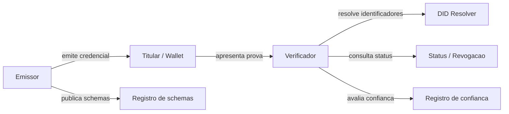

# DID, SSI e ZKP

Laboratorio de referencia para identidade descentralizada, credenciais verificaveis e provas de conhecimento zero, com foco em interoperabilidade, privacidade e aplicabilidade ao contexto brasileiro.

Este repositorio organiza pesquisa, arquitetura, fontes primarias, exemplos e um roadmap de evolucao para projetos envolvendo:

- DIDs, ou identificadores descentralizados.
- SSI, ou identidade autossoberana.
- VCs, ou credenciais verificaveis.
- VPs, ou apresentacoes verificaveis.
- ZKPs, disclosure seletivo e provas derivadas.

## Proposta

O objetivo e sair de uma lista de links e construir uma base tecnica reutilizavel para PoCs, estudos e implementacoes de identidade digital centrada no usuario.

A tese central do projeto e que credenciais digitais podem ser emitidas por autoridades confiaveis, armazenadas em carteiras sob controle do titular e apresentadas a verificadores com divulgacao minima de dados. Essa tese se apoia no modelo emissor, titular e verificador definido pelo W3C Verifiable Credentials Data Model v2.0 e nos fluxos de emissao e apresentacao definidos pela OpenID Foundation em OpenID4VCI e OpenID4VP.

Fontes base: [W3C VC Data Model v2.0](https://www.w3.org/TR/vc-data-model-2.0/), [OpenID4VCI 1.0](https://openid.net/specs/openid-4-verifiable-credential-issuance-1_0-final.html), [OpenID4VP 1.0](https://openid.net/specs/openid-4-verifiable-presentations-1_0-final.html).

## Principio de fontes

Toda afirmacao factual relevante deve apontar para uma fonte primaria ou oficial. Quando uma afirmacao for hipotese, inferencia ou recomendacao de arquitetura, ela deve ser marcada como tal.

Veja a matriz de origem em [docs/sources.md](docs/sources.md).

## Mapa do repositorio

- [docs/architecture.md](docs/architecture.md): arquitetura de referencia, atores, fluxos e decisoes.
- [docs/standards.md](docs/standards.md): padroes e protocolos recomendados.
- [docs/brazil.md](docs/brazil.md): contexto brasileiro, CIN, GOV.BR, ICP-Brasil e LGPD.
- [docs/use-cases.md](docs/use-cases.md): casos de uso priorizados.
- [docs/roadmap.md](docs/roadmap.md): fases de expansao do projeto.
- [docs/sources.md](docs/sources.md): fontes oficiais, primarias e escopo de uso.
- [examples](examples): exemplos sinteticos de credenciais e apresentacoes.

## Arquitetura de referencia

Resumo dos papeis:

- Emissor: entidade que assina declaracoes sobre um sujeito.
- Titular ou holder: pessoa, organizacao ou agente que recebe e controla a credencial.
- Wallet: software que guarda credenciais e cria apresentacoes.
- Verificador: entidade que solicita e valida provas.
- Registro de confianca: camada que ajuda o verificador a decidir quais emissores aceitar.

Fontes: [W3C DID Core](https://www.w3.org/TR/did-core/), [W3C VC Data Model v2.0](https://www.w3.org/TR/vc-data-model-2.0/), [OpenID4VP 1.0](https://openid.net/specs/openid-4-verifiable-presentations-1_0-final.html).

## Direcao tecnica sugerida

Para uma primeira PoC:

- Usar `did:web` para emissores institucionais, por ser simples de publicar em dominio HTTPS.
- Usar `did:key` ou identificadores efemeros para exemplos de titulares, evitando correlacao desnecessaria.
- Modelar credenciais no W3C VC Data Model v2.0.
- Usar OpenID4VCI para emissao e OpenID4VP para apresentacao.
- Comecar com assinatura verificavel simples e evoluir para disclosure seletivo ou BBS/ZKP quando houver necessidade real de privacidade.

`did:web` e `did:key` sao recomendacoes pragmaticas para PoC, nao uma decisao definitiva de producao. Fontes: [did:web Method Specification](https://w3c-ccg.github.io/did-method-web/), [did:key DID Method Specification](https://w3c-ccg.github.io/did-key-spec/), [W3C DID Methods Registry](https://w3c.github.io/did-extensions/methods/).

## Contexto brasileiro

A Carteira de Identidade Nacional usa o CPF como numero unico, possui formato fisico e digital e inclui QR Code para verificacao. O GOV.BR tambem possui niveis de conta bronze, prata e ouro, com diferentes mecanismos de validacao. A ICP-Brasil fornece certificados digitais para identificacao segura e assinaturas eletronicas qualificadas.

Esses elementos nao devem ser confundidos automaticamente com SSI ou DID. Eles formam o contexto institucional brasileiro que uma proposta de credenciais verificaveis precisa respeitar.

Fontes: [CIN - Governo Digital](https://www.gov.br/governodigital/pt-br/identidade/identificacao-do-cidadao-e-carteira-de-identidade-nacional/carteira-de-identidade-nacional-cin), [Niveis da conta GOV.BR](https://www.gov.br/governodigital/pt-br/identidade/conta-gov-br/niveis-da-conta-govbr), [Certificacao Digital - ITI](https://www.gov.br/iti/pt-br/acesso-a-informacao/perguntas-frequentes/certificacao-digital), [LGPD](https://www.planalto.gov.br/ccivil_03/_Ato2015-2018/2018/Lei/L13709compilado.htm).

## Casos de uso iniciais

- Prova de maioridade sem revelar data de nascimento.
- Diploma verificavel com apresentacao seletiva do curso e instituicao.
- Onboarding de colaboradores com verificacao de vinculo profissional.
- Credencial organizacional para representantes de empresas.
- Provas de atributos para acesso a servicos publicos ou privados com minimizacao de dados.

Detalhes em [docs/use-cases.md](docs/use-cases.md).

## Roadmap resumido

1. Organizar a base documental e a politica de fontes.
2. Criar exemplos de credenciais e apresentacoes sinteticas.
3. Implementar uma PoC de emissao e verificacao.
4. Adicionar status/revogacao e validacao de schema.
5. Evoluir para disclosure seletivo e provas derivadas.
6. Mapear aderencia juridica, operacional e de governanca no Brasil.

Detalhes em [docs/roadmap.md](docs/roadmap.md).

## Contribuindo

Contribuicoes sao bem-vindas, desde que sigam a regra de rastreabilidade:

- Use fontes oficiais ou primarias sempre que possivel.
- Marque claramente exemplos sinteticos.
- Separe fato, interpretacao e proposta.
- Evite inserir identificadores pessoais reais em exemplos.

Veja [CONTRIBUTING.md](CONTRIBUTING.md).

## Licenca

MIT. Veja [LICENSE](LICENSE).
