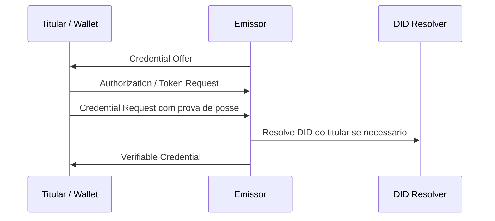
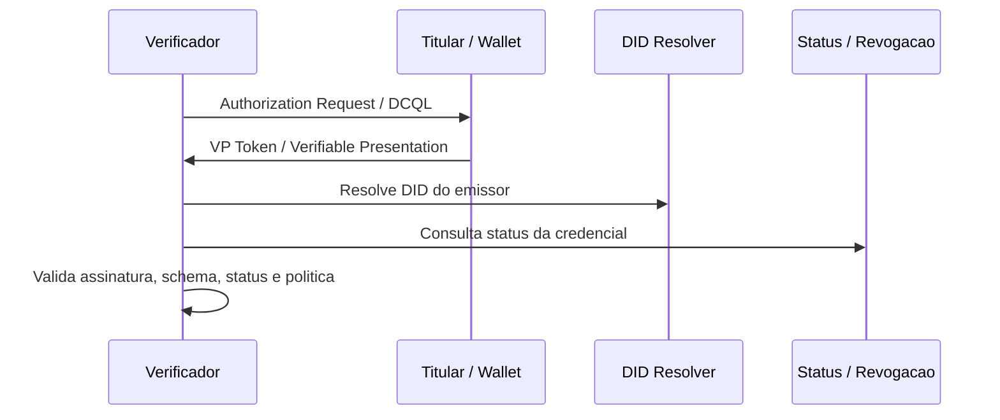

# Arquitetura de Referencia

Esta arquitetura e uma proposta inicial. Os papeis e conceitos principais seguem W3C DID Core, W3C VC Data Model v2.0, OpenID4VCI e OpenID4VP. Fontes: S1, S2, S7, S8 em [sources.md](sources.md).

## Objetivo

Criar uma base para emitir, guardar, apresentar e verificar credenciais digitais com minimizacao de dados, rastreabilidade de fontes e possibilidade de evoluir para disclosure seletivo ou ZKP.

## Atores

| Ator | Responsabilidade | Fonte |
| --- | --- | --- |
| Emissor | Emite credenciais assinadas sobre um sujeito. | S2 |
| Titular / Holder | Controla a credencial e decide quando apresenta-la. | S2 |
| Wallet | Guarda credenciais, chaves e cria apresentacoes. | S2, S8 |
| Verificador | Solicita e verifica apresentacoes. | S2, S8 |
| DID Resolver | Resolve DIDs para recuperar material de verificacao. | S1 |
| Registro de status | Permite verificar suspensao ou revogacao. | S5 |
| Registro de schemas | Publica estruturas versionadas de credenciais. | S2 |
| Registro de confianca | Ajuda a decidir quais emissores, schemas e politicas sao aceitos. | S15 |

## Fluxo de emissao

Fonte do fluxo: OpenID4VCI (S7). A resolucao de DID segue DID Core (S1).

## Fluxo de apresentacao

Fonte do fluxo: OpenID4VP (S8), VC Data Model v2.0 (S2), Bitstring Status List (S5).

## Decisoes iniciais para PoC

| Decisao | Escolha inicial | Motivo | Fonte |
| --- | --- | --- | --- |
| DID do emissor | `did:web` | Facilita publicacao por dominio HTTPS em ambiente de laboratorio. | S12 |
| DID do titular | `did:key` ou identificador efemero | Reduz dependencia de infraestrutura para exemplos. | S13 |
| Modelo de credencial | VC Data Model v2.0 | Padrao W3C atual para VCs. | S2 |
| Emissao | OpenID4VCI | Especificacao final OpenID para emissao. | S7 |
| Apresentacao | OpenID4VP | Especificacao final OpenID para apresentacao. | S8 |
| Status | Bitstring Status List | Mecanismo W3C com foco em privacidade. | S5 |

Essas escolhas sao ponto de partida. A decisao final deve considerar governanca, compliance, experiencia da wallet, risco de correlacao e maturidade da stack.

## Requisitos de privacidade

1. O verificador deve pedir apenas os atributos necessarios.
2. A apresentacao deve declarar o proposito da solicitacao.
3. Identificadores persistentes devem ser evitados quando nao forem necessarios.
4. CPF, biometria, documentos nacionais e dados sensiveis nao devem aparecer em exemplos publicos.
5. Qualquer status de credencial deve evitar criar telemetria de uso indevida.

Fontes: VC Data Model v2.0 (S2), LGPD (B4), CIN/GOV.BR quando aplicavel (B1, B2).

## Validacao minima

Uma verificacao basica deve cobrir:

- assinatura ou prova criptografica;
- emissor e chave de verificacao;
- periodo de validade;
- status da credencial;
- schema esperado;
- aderencia ao proposito da solicitacao;
- politica de confianca do verificador.

Fontes: S2, S3, S4, S5.

## Perguntas em aberto

- Qual metodo DID deve ser usado em producao para emissores brasileiros?
- Como mapear uma autoridade emissora brasileira para um registro de confianca?
- Quando usar SD-JWT, BBS, AnonCreds ou outro mecanismo de disclosure?
- Como tratar revogacao sem criar correlacao entre titular e verificador?
- Como alinhar VCs com CIN, GOV.BR, ICP-Brasil e LGPD sem duplicar ou expor identificadores nacionais?
